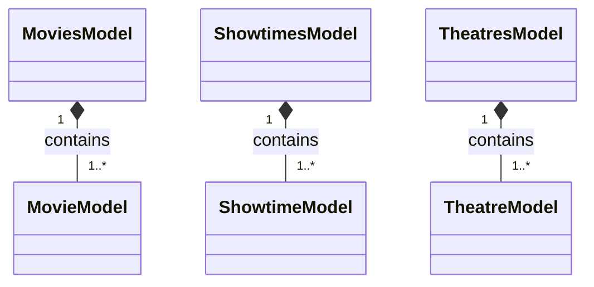
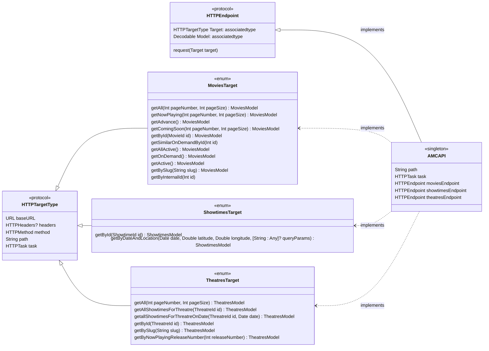

# AMCAPI
#### A Combine framework for accessing AMC theatre and movie information using AMC's published API.
This framework is a relatively simple wrapper for the API published at AMC's [Developer Portal](https://developers.amctheatres.com). Its use of the API is limited in that I have only implemented support for authorizing and performing fetches of movie information, showtime information, and theatre information. Support for ordering tickets and concessions are absent. Since the time of this writing any other features that may have been added to the API are also not supported (but can be easily added, if I got it right).

## Background
My original purpose in creating this library was to see if I could employ Combine and URLSession to produce an internal framework that could be used to create API wrappers in a way that is (mostly) declarative and scalable. In order to make it somewhat declarative, I'm leveraging protocol oriented programming and enumeration. My original pattern for this experiment is based on the combination of [Moya](https://github.com/moya/moya) and [Alamofire](https://github.com/alamofire/alamofire), which I used very successfully on a previous contract that supported more than 120 API calls spread across more than 30 API endpoints.

When I started contributing to the existing code base for the aforementioned contract, the sole remaining engineer, previous to my arrival, had already begun the process of migrating away from a monolithic god class to an solution based on separate API targets implemented as Moya endpoints. Instead of Combine, he was using RxSwift and friends. This is were I received my first practical experience with reactive programming. As it turns out, I discovered that I really liked reactive programming. So when I decided to create libraries for my own API programming projects, I first considered continuing with Moya, Alamofire, and RxSwift. There were a couple of problems with that approach.

First, there are a number of third-party dependencies that are required for even relatively small solutions. It is a lot of extra code to support. I had previously spent two and a half years on this contract, maintaining two major medical apps using this technology, along with Carthage as the dependency manager. Every time Apple released an update to iOS, our build would break and it would take days (sometimes longer) in order to get the product building again. In some cases I would have to fork a third-party library and make the repairs myself.

The second major problem for me was Carthage. Its way of doing things with lipo is slow and proved to be fragile when Apple made changes to Xcode and compiler behavior. This was especially the case when support for Apple's M1 was rolled out. Carthage became unusable for weeks. There were some workarounds using Xcode config files but it was really frustrating.   

From this experience, I decided that I wanted to use as few third-party dependencies as possible and that I wanted to use something other than Carthage for dependency management.

For these reasons, I decided to create my own light version of a Moya-type framework for use with URLSession, leaving out Moya and Alamofire, completely. I also kicked Carthage to the curb and went with Swift Package Manager, which was now mature enough to get the job done. Life is much better here. By using Apple's own technology for reactive programming and dependency management. I have a lot less code to keep in sync with Apple. I expect that SPM, Combine, and SwiftUI will continue to improve with time and I anticipate fewer hassles with more capability with each subsequent release of these technologies.

## Domain Models


## APICore Design
The following diagram shows, at a high level, most of the details with regard to dependency and implementation for the various entities that make up the `APICore` implementation. In order to keep the diagram readable, a fair amount of detail has been left out. See the code for full details. The diagram should help with assimilation the code.



## AMCAPI Usage
The API object vended from the library is `AMCAPI`. It is a singleton with functions for setting your authorization key, which you obtain from AMC's developer portal, and for fetching movie, showtime, and theatre information.
### Setting Your Authorization Key
Before you make any API calls you need to set your vendor authorization key. Every AMC API call must include an `X-AMC-Vendor-Key` header. This header must have a valid key issued from AMC's portal. After registering with AMC as a developer, it took about 10 days before my key began to be recognized. I'm not sure what the standard is so your mileage may vary. Once you've obtained the key, you need only make a single call to `setVendorAuthKey`, as shown below. Once this is done, your key will be included with the appropriate header in every subsequent AMC API request.

```
let vendorAuthKey = "Some magic sequence I got from http://developers.amctheatres.com"
AMCAPI.shared.setVendorAuthKey(vendorAuthKey)
```
I do not validate the value passed into `setVendorAuthKey` and you can call this method as often as you wish to change its value. Passing in a zero length string yields undefined behavior because I haven't tested it. I simply assume you know what you are doing. This may have been a mistake. Time will tell.

### Fetching Movie Information
I've distilled AMC's JSON definitions for movie information down into two main `Codable` model structures. These are `MoviesModel` and `MovieModel`. `MoviesModel` is a JSON container for one or more `MovieModel` elements. `MovieModel` is a JSON object that contains all of the properties you might expect when thinking about movie information, including multiple links and URLs to trailer and poster media. For complete details regarding these models, look at the code or visit the [Movies](http://developers.amctheatres.com/Movies) page on AMC's portal. 

#### Fetching Active Movies
```swift
func fetchActiveMovies() -> AnyPublisher<MoviesModel, Swift.Error>
```
I don't know what an 'active' movie is; I couldn't find a definition for this on AMC's web site but I assume these are movies that are either currently in theatres or about to be in theatres. You can fetch active movies using the following code.

```swift
let subscriptions = Set<AnyCancellable>()

AMCAPI.shared.fetchActiveMovies().sink { [weak self] completion in
  if case let .failure(error) = completion {
    print("Failed to fetch active movies. Error: \(error.localizedDescription)")
  }
} receiveValue: { [weak self] model in
  // Process returned model here.
}
.store(in: &subscriptions)
```
#### Fetching Advance Ticket Movies
```swift
func fetchAdvanceTicketMovies() -> AnyPublisher<MoviesModel, Swift.Error>
```
```swift
AMCAPI.shared.fetchAdvanceTicketMovies().sink { [weak self] completion in
  // Handle completion here.
} receiveValue: { [weak self] model in
  // Process returned model here.
}
```
#### Fetching All Movies
```swift
AMCAPI.shared.fetchAllMovies(pageNumber: Int = 1, pageSize: Int = 10) -> AnyPublisher<MoviesModel, Swift.Error>
```
After writing the code for this function, I questioned whether or not it was practical and should be included. My thinking is that the common use case is to get a listing of what is currently active or now playing in the threatre. Why would anyone using a convenience app what to list every single movie in AMC's current database? I don't have an answer for that question. However, the function is here and the results can be accessed in pages, as show in the parameter list for this function.

The resulting model includes the current page and page size as well as the total count for the query. Using this information, you could page through the entire result set using repeated API calls. Or, conveniently, you could use the embedded  **Previous**, **Next**, and **Self** URLs that are also included in the returned model. With these you can page forwards or backwards through the result. I currently don't support this through my API but I probably will in the next iteration. This saves us from having to do our own bookkeeping or otherwise generating inconsistent or conflicting results that could yield duplicates or cause us to miss data from the initial query.

Note that omitting any parameters will result in fetching the first page of 10 movie results as show below.

```swift
AMCAPI.shared.fetchAllMovies().sink { [weak self] completion in
  // Handle completion here.
} receiveValue: { [weak self] model in
  // Process returned model here.
}
```
#### Fetch Coming-Soon Movies
```swift
fetchComingSoonMovies(pageNumber: Int = 1, pageSize: Int = 10) -> AnyPublisher<MoviesModel, Swift.Error>
```
```swift
AMCAPI.shared.fetchComingSoonMovies().sink { [weak self] completion in
  // Handle completion here.
} receiveValue: { [weak self] model in
  // Process returned model here.
}
```
#### Fetch a Single Movie With ID
```
func fetchMovie(with id: MovieId) -> AnyPublisher<MovieModel, Swift.Error>
```
#### Fetch Now-Playing Movies
```swift
fetchNowPlayingMovies(pageNumber: Int = 1, pageSize: Int = 10) -> AnyPublisher<MoviesModel, Swift.Error>
```
```swift
AMCAPI.shared.fetchNowPlayingMovies().sink { [weak self] completion in
  // Handle completion here.
} receiveValue: { [weak self] model in
  // Process returned model here.
}
```
## Fetching Showtime and Theatre information
The usage information for fetching Showtime and Theatre information is virtually identical to the usage of the API for fetching Movie information. Therefore, I am not going to repeat those details here. Once you read the code or take a look at the unit tests, you will get it.

## Unit Tests
I did write a number of simple and straightforward unit-tests, or perhaps more correctly, integration tests, along the way to creating my API wrappers. Most of these tests will not run for you out of the gate. This is due to the fact that I did not want to include my registered vender authorization key in the source code repository, for obvious reasons. You'll have to go back and add your key to the `setUp()` function for each of the test classes. Once this is done, all tests should pass. If they don't, it means that AMC has changed something since the tests were written. Feel free to roll-up your sleeves and fix it. Submit a pull-request and I'll integrate the changes. Otherwise, You'll have to wait till I get around to taking care of it.

## APICore Usage
APICore is the internal dependency used by AMCAPI for implementation. It includes the enums, protocols, and structure that make it possible to declare targets and endpoints in a way that gets the compiler to do most of the work required to manage a large set of API calls. With very little effort, one can create a number of API implementations without a lot of complexity, redundancy, or boilerplate.

In order to create your own API wrappers using the core, do the following:

Step #1: Declare an of enumeration that implements the `HTTPTargetType` protocol. Each enum should be named and parameterized according to the existing underlying API call it is intended to wrap.
 
```swift
enum MyAPITarget: HTTPTargetType {
  case firstAPICall(arg1: Int, arg2: String)
  case secondAPICall(arg: [String: Any])
  case thirdNoArgAPICall
}
```
Step #2: Create your `Codable` models used for input and output to the various API calls you plan to implement wrappers for.
 
```swift
struct MyModel: Codable, Equatable {
  let id: Int
  let name: String
  let values: [Int]
}
```
Step #3: Create a structure that implements the `HTTPEndpoint` protocol. In this structure you must define type aliases for `Target` and `Model`. The target defines all of the parameters needed to execute the API call and the model defines the returned `Decodable` type that should result from a successful API call. Use the target-type and model created from steps #1 and #2 for these aliases, respectively.

```swift
struct MyAPIEndpoint: HTTPEndpoint {
  typealias Target = MyAPITarget
  typealias Model = MyModel
}
```
Step #4: Create an extension for the enumeration you just declared in step #1 and implement the required protocol stubs for the path and task. Optionally, you can define a set of HTTP headers, as needed, for each API call you are wrapping. Assuming that each API wrapper requires a different path, task, and headers value, you can `switch` on the `enum` to provide those individual values on a per API call basis, as shown below.

```swift
extension MyAPITarget {
  var path: String {
    switch self {
    case let .firstAPICall(arg1, arg2):
      return "/v1/firstAPI/\(arg1)/(arg2)"
    case .secondAPICall:
      return "/v1/secondAPI"
    case .thirdNoArgAPICall:
      return "/v1/thirdAPI"
    }
  }
  
  var headers: HTTPHeaders {
    switch self {
    case .firstAPICall, .secondAPICall:
      return ["key1": "value1", "key2": "\(value2)"]
    default: // .thirdNoArgAPICall
      return ["key3": "\(value3)"]
  }
  
  var task: HTTPTask {
    switch self {
    case .firstAPICall:
      return .requestPlain
    case .secondAPICall(let arg):
      return .requestParams(arg)
    case .thirdNoArgAPICall:
      return .requestPlain
    }
  }
}
```
Step #5: You will also need to create the associated endpoint value and make sure it is accessible to your wrapper functions.

```swift
let myAPIEndpoint = MyAPIEndpoint()
```
Final Step: Invoke your API calls from you wrappers using the `HTTPEndpoint.request` method.

```swift
func firstAPICall(arg1: Int, arg2: String) -> AnyPublisher<MyModel, Swift.Error> {
  do {
    let publisher = try myAPIEndpoint.request(.firstAPICall(arg1, arg2))
    return AnyPublisher<MyModel, Swift.Error>(processPublisherResults(publisher))
  } catch {
    return Fail<MyModel, Swift.Error>(error: error).eraseToAnyPublisher()
  }
}

internal func processPublisherResults<T: Decodable>(_ publisher: URLSession.DataTaskPublisher) -> AnyPublisher<T, Swift.Error> {
  publisher.receive(on: apiQueue).tryMap({ element -> Data in
    guard
      let httpResponse = element.response as? HTTPURLResponse, (200..<300).contains(httpResponse.statusCode) else {
      if let errors = try? decoder.decode(AMCAPI.Errors.self, from: element.data) {
        throw errors
      } else {
        throw URLError(.badServerResponse)
      }
    }
    return element.data
  })
  .decode(type: T.self, decoder: decoder)
  .eraseToAnyPublisher()
}

```

## Final Thoughts
This is all highly experimental for me. Though I doubt it will be useful for anyone else, I couldn't think of a down-side to putting it up on GitHub. I figure in the worst case, I will get valuable feedback regarding better ways to do what I'm trying to do. On the positive side, maybe this code; this exploration, will inspire or help someone else who is also learning Combine or perhaps is new to Apple software development and network programming in general.

## License
AMCAPI is released under an MIT license. See [License.md](https://github.com/StateMachineJunkie/AMCAPI/blob/main/License.md) for more information.
